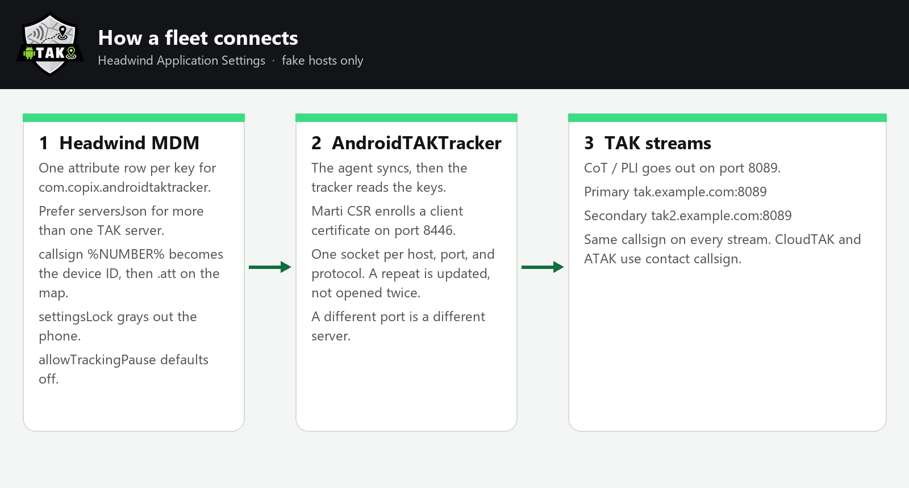
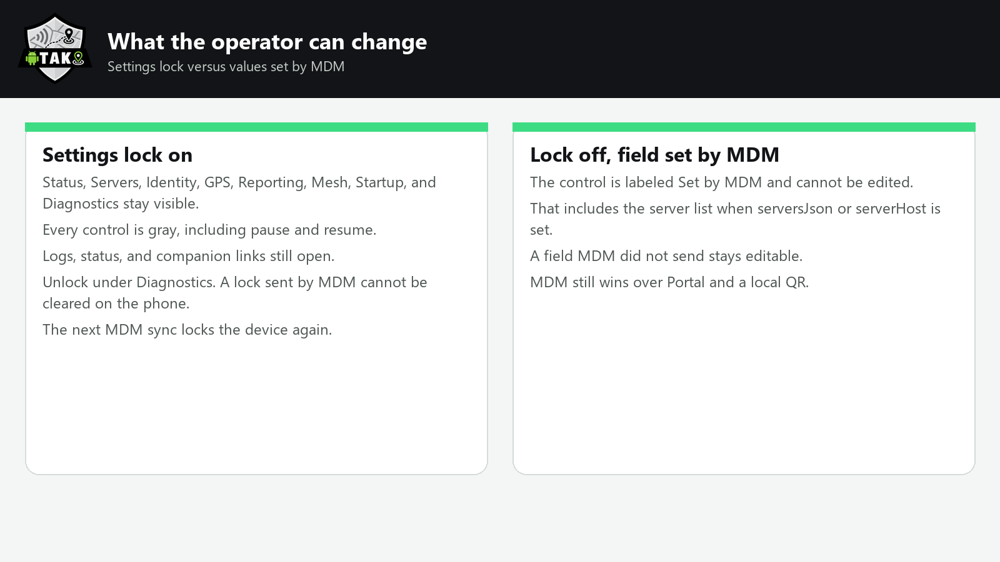
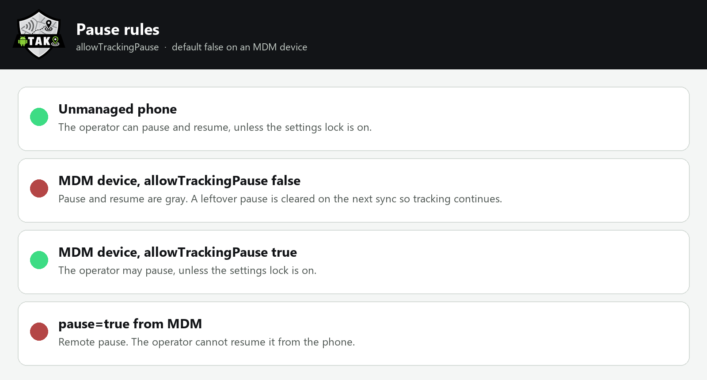

<p align="center">
  
</p>

# AndroidTAKTracker

Tracking-only TAK PLI client for Android, by **CopIX LLC**. Sibling of [WinTAKTracker](https://github.com/CopIXus/WinTAKTracker).

## What it is

- Reports ATAK-shaped self-SA (PLI) to TAK Server over TLS/mTLS or cleartext TCP
- Enrollment via QR / Portal deep links (`tak://`, `opentaktracker://`), Marti CSR, SoftCert ZIP
- Headwind MDM Application Settings (binds the agent) + Android Enterprise managed configuration (precedence: MDM > Portal > local/QR). Setup and a multi-server JSON example are below. Operator recipe: [`docs/headwind-mdm.md`](docs/headwind-mdm.md).
- Boot-start foreground service, Mesh SA multicast, Portal callsign push (`.att` suffix)
- Optional **Defer to ATAK** so phone + ATAK do not double-publish PLI
- In-app GitHub Releases updater with CHANGELOG notes (disabled by default when MDM is present)

## MDM setup

Push servers, callsign, and a settings lock from an MDM so a fleet connects with no operator taps. Precedence is **MDM > Portal > local/QR**.

Package ID: `com.copix.androidtaktracker` (debug builds: `com.copix.androidtaktracker.debug`). Ship the signed release APK. A debug build will not update a release install.

The examples below use fake hosts (`tak.example.com`). Do not commit real TAK hosts, users, passwords, or enroll URLs.

The shield at the top of this page is the app icon and the About screen mark. Empty pixels around the shield are transparent, not black.

### How it works

<p align="center">
  
</p>

<p align="center">
  
</p>

<p align="center">
  
</p>

### Headwind MDM

Headwind **Application Settings** are not Android Enterprise restrictions. The tracker binds the Headwind agent (`com.hmdm.action.Connect`) and reads `queryAppPreference`. Adding keys in the console does nothing until the agent syncs and the tracker process starts.

1. QR-enroll Headwind as **Device Owner** (factory-reset phone). Without Device Owner the user must tap through install and runtime permissions.
2. **Applications** → Add → upload `AndroidTAKTracker.apk`. Assign the configuration as **Install**, **Run after install**, and **Run at boot** (skip Run at boot if this app is already the kiosk content app).
3. On the configuration, enable **Autostart apps in foreground**.
4. Configuration → **Application settings**. Application = `com.copix.androidtaktracker`. Add one attribute per row (name = key, value = value).
5. Prefer a single `serversJson` attribute when you have more than one TAK server. Flat `serverHost` is ignored while that JSON parses.

Headwind expands `%NUMBER%`, `%DESCRIPTION%`, `%CUSTOM1%`–`%CUSTOM3%`, `%IMEI%`, and `%PHONE%` before the app sees the value, including inside `serversJson`. `%NUMBER%` or a blank/`mdmDeviceId` callsign becomes the Headwind device ID. The map label still gets `.att` so it does not collide with ATAK or WinTAKTracker.

Keep-alive / restart if the process dies. Headwind cannot grant “App battery usage → Unrestricted”; the tracker asks once the first time it is in the foreground. Reporting does not depend on that Allow tap. Full notes: [`docs/headwind-mdm.md`](docs/headwind-mdm.md).

### Android Enterprise (Intune and others)

Same key names in managed configuration (`RestrictionsManager` / `app_restrictions.xml`). Put `serversJson` in one string restriction.

### Attributes

| Attribute | Example | Notes |
|---|---|---|
| `serversJson` | see below | One JSON value for multiple TAK servers, identity, and the settings lock. Wins over `serverHost` when it parses. |
| `serverHost` | `tak.example.com` | Single-server fallback. Ignored when `serversJson` is valid. |
| `serverPort` | `8089` | CoT stream port |
| `serverProtocol` | `ssl` | `ssl` or `tcp` |
| `enrollPort` | `8446` | Marti CSR port (default 8446) |
| `username` | `USER` | TAK enroll user (HTTP Basic) |
| `password` | `TOKEN` | TAK enroll password. `token` is an alias. |
| `callsign` | `%NUMBER%` | Headwind device ID, `mdmDeviceId`, or a fixed string |
| `team` | `Cyan` | Optional ATAK team color |
| `role` | `Team Member` | Optional ATAK role |
| `settingsLock` | `LOCKCODE` | Grays out every local setting, including pause. Screens stay readable. Re-applied on every sync. |
| `settingsLockClear` | `true` | Clears the lock only when `settingsLock` is empty. A non-blank lock wins if both are set. |
| `allowInsecureTlsSoftAccept` | `true` | Lab CAs only. Also a per-server flag inside `serversJson`. |
| `allowTrackingPause` | `false` | MDM-managed devices cannot pause unless this is `true`. |
| `requestBatteryExemption` | `true` | Whether the app asks once. Does **not** grant the exemption. |
| `preventSleepWhileTracking` | `true` | Partial wake lock while the foreground service runs. Default when MDM applies. |
| `enrollUrl` | `opentaktracker://enroll?host=…` | Optional single-field enroll. Do not embed a live token in a shared config. |

`username` + `password` run the same Marti CSR enroll as Quick Connect. After a client cert is stored, later syncs do not re-enroll. The same host, port, and protocol is one connection — a duplicate in JSON or a second profile is updated, not opened twice. A different port is a different server.

With the settings lock on, every settings screen stays readable but the controls are grayed out, including pause. With the lock off, a field MDM actually sent is labeled **Set by MDM** and cannot be edited — including the server list. Other fields stay editable.

### Pause (`allowTrackingPause`)

On a device managed by MDM, the operator cannot pause or resume tracking unless you set `allowTrackingPause` to `true`. The default is off. Unlocking the settings lock does not override that.

| Value | What the operator can do |
|---|---|
| omitted or `false` | Pause and resume stay gray. A leftover operator pause is cleared on the next sync so tracking continues. |
| `true` | The operator may pause, unless the settings lock is also on. |
| `pause` = `true` | Remote pause from MDM. The operator cannot clear it on the phone. |

Put it in the same `serversJson` object as the lock and servers, or as its own Application Setting.

Callsign, team, and role are device-wide: one PLI identity, many TAK streams. If those fields are in both the JSON and flat attributes, the JSON wins.

### Demo JSON (multiple servers)

Paste this as the value of `serversJson`. Replace the fake host, user, and password in your MDM console — do not commit the real values.

```json
{
  "settingsLock": "LOCKCODE",
  "callsign": "%NUMBER%",
  "team": "Cyan",
  "role": "Team Member",
  "allowInsecureTlsSoftAccept": false,
  "allowTrackingPause": false,
  "requestBatteryExemption": true,
  "preventSleepWhileTracking": true,
  "servers": [
    {
      "host": "tak.example.com",
      "port": 8089,
      "protocol": "ssl",
      "enrollPort": 8446,
      "username": "USER",
      "password": "TOKEN",
      "name": "Primary"
    },
    {
      "host": "tak2.example.com",
      "port": 8089,
      "protocol": "ssl",
      "enrollPort": 8446,
      "username": "USER",
      "password": "TOKEN",
      "name": "Secondary"
    }
  ]
}
```

An array (`[{"host":"tak.example.com", ...}]`) is servers only. An object can also set identity and the lock, as above.

Server fields: `host`, `port` (8089), `protocol` (`ssl` or `tcp`), `enrollPort` (8446), `username`, `password` or `token`, `name` (or `displayName`), optional `allowInsecureTlsSoftAccept`.

### Updates under MDM

In-app GitHub Releases update is off when an MDM agent is present. Ship a new APK through Headwind **Applications** or your EMM.

## What it is not

- **No video.** For Android video push/play, use **[ICU VideoStreamer](https://github.com/jpat-12/TAK-PluginSuite-ICU_VideoStreamer/releases/tag/2.4.0)** (or equivalent). See `docs/feature-parity.md` (`FP-VIDEO`).

## License

Source-available under **AndroidTAKTracker Free Application License 1.0** (see `LICENSE`). Free to use; do not sell the app itself. Paid install/support services are fine.

## Samples

Fake hosts only — see `samples/enrollment.example.txt` and `samples/config.example.json`. Never commit real TAK hosts, tokens, or certs.

## Build

```bat
gradlew.bat :app:assembleDebug
gradlew.bat :core:testDebugUnitTest
```

Requires Android SDK (create `local.properties` with `sdk.dir=…`; that file is gitignored).

Continuous releases publish `build-0.1.<run>` tags with a **signed** `AndroidTAKTracker.apk` + `.sha256` and a Play-ready `AndroidTAKTracker.aab`; pushing a `vX.Y.Z` tag publishes a versioned release with CHANGELOG notes. Signing keys, Play App Signing and Play Console declarations are covered in [`docs/release.md`](docs/release.md).

### Sideload install

1. On the phone: Settings → allow install from the browser/Files app (unknown apps).
2. Download the latest release APK (not an older unsigned build).
3. If you previously installed a debug/unsigned build, uninstall it first — Android rejects signature mismatches with a generic “App not installed”.

## Feature parity

See [`docs/feature-parity.md`](docs/feature-parity.md). A scheduled workflow diffs this table against WinTAKTracker and opens a parity-drift issue when IDs diverge.
